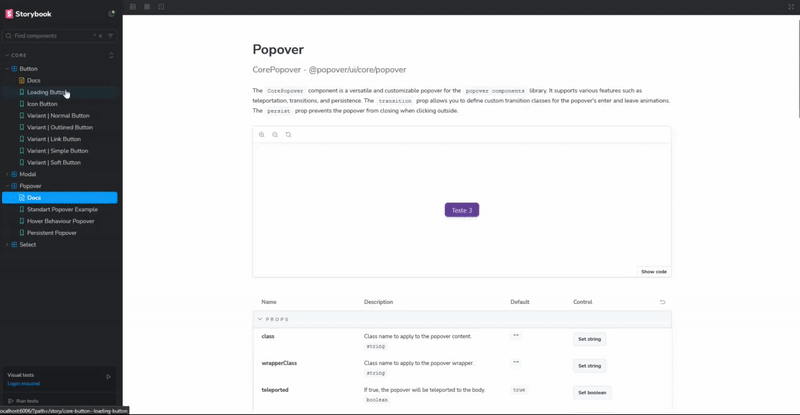

# Popover Components

Welcome to the Popover Components project! This repository contains a collection of reusable popover components for your web applications.

## Demonstration

To see the popover components in action, check out the demonstration below:

<h3 align="center">
  <a href="https://popover-components-client.vercel.app/?path=/docs/core-button--docs"><< VISIT STORYBOOK DOCS >></a>
</h3>

<br />




## Table of Contents

- [Installation](#installation)
- [Usage](#usage)
- [Development](#development)
- [License](#license)

## pnpm workspaces boiler plate:
To create the foundation for this project, I followed a tutorial that demonstrates how to set up a pnpm workspace. You can find the resources below:

- [Video Tutorial](https://www.youtube.com/watch?v=HM03XGVlRXI)
  - Complete guide
- [Repository](https://github.com/mihailtd/demo-monorepo/tree/main)
  - Example code

## Adding module to workspace
If you are using pnpm workspaces, there is an easy way to add the component library to your main project. After downloading the project, you can add the package to your application or library using the code below. Please ensure that the [`pnpm-workspace.yaml`](./pnpm-workspace.yaml) file is set up correctly.

```sh
$ pnpm --filter {{your app/package}} add -D @popover/ui@workspace:*
```

### Adding other utils if necessary
```sh
$ pnpm --filter {{your app/package}} add @popover/tailwind-config@workspace:*
```

```sh 
$ pnpm --filter {{your app/package}} add @popover/tw-utils@workspace:*
```


> [!warning]
> This project uses ESLint version 9, which supports the `.eslintrc` format for configuration. However, newer versions of ESLint use a different configuration format called flat config. To ensure compatibility with the `.eslintrc` format, the `useFlatConfig` setting in the [.vscode/settings.json](.vscode/settings.json) file has been toggled to `false`. This allows the project to continue using the traditional `.eslintrc` configuration file. 
> An alternative to this is changing the [.eslintrc file](./.eslintrc) to the [eslint.config.js file format](https://eslint.org/blog/2023/10/flat-config-rollout-plans/) that will be compatible with ESLint 9 and beyond. Make sure to use the correct ESLint extension as well.

## Installation

To install the dependencies, run the following command:

```sh
$ pnpm install
$ pnpm setup
```

## Usage

To use the popover components in your project, it is necessary to build all the packages from the project using the command:

```bash
$ pnpm run -w build:pkg
```


After this, import them as needed after installing it into the respective app or package(examples on [/apps/client/src/App.vue](./apps/client/src/App.vue)):


```js
import { CorePopover, CoreButton } from '@popover/components';
```

#### Running StoryBook

To use the **storybook** on the project, run the following command:

```sh
$ pnpm storybook
```


## Development

To start developing the project, follow these steps:

1. Clone the repository:
  ```sh
  $ git clone https://github.com/your-username/popover-components.git
  ```

2. Navigate to the project directory:
  ```sh
  $ cd popover-components
  ```

3. Install the dependencies:
  ```sh
  $ pnpm install
  $ pnpm setup
  ```

4. Build packages
  ```sh
  $ pnpm run -w build:pkg
  ```


5. Start the development server:
  ```sh
  $ pnpm dev
  ```


## License

This project is licensed under the MIT License. See the [LICENSE](LICENSE) file for more details.

> [!warning]
> Using node version 22.10.0


